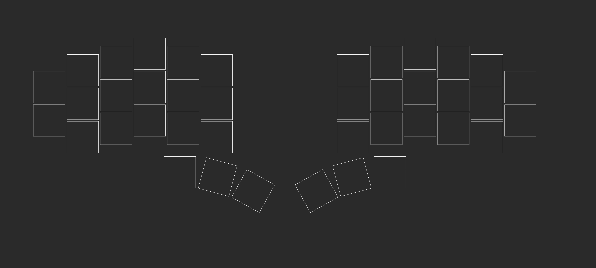
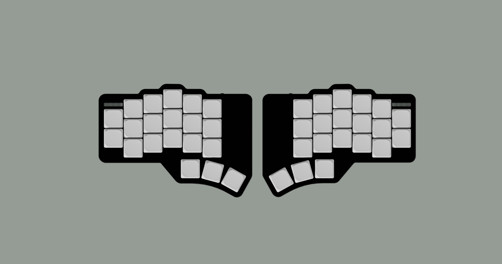
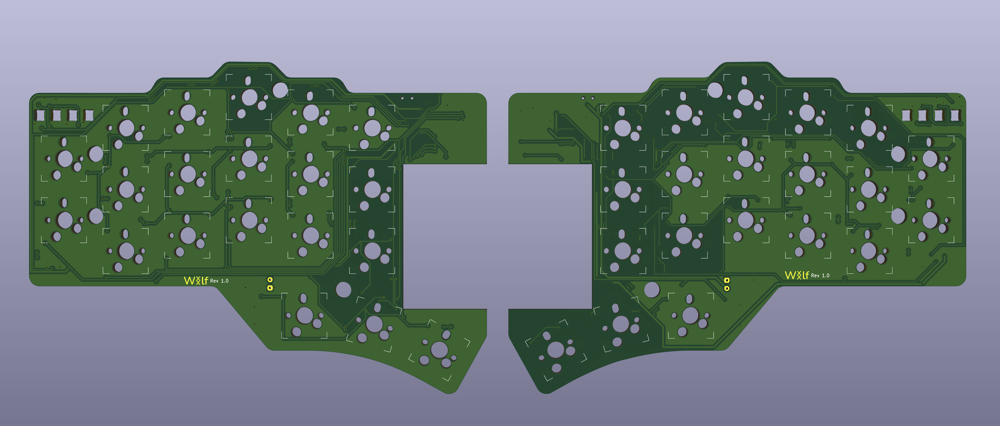
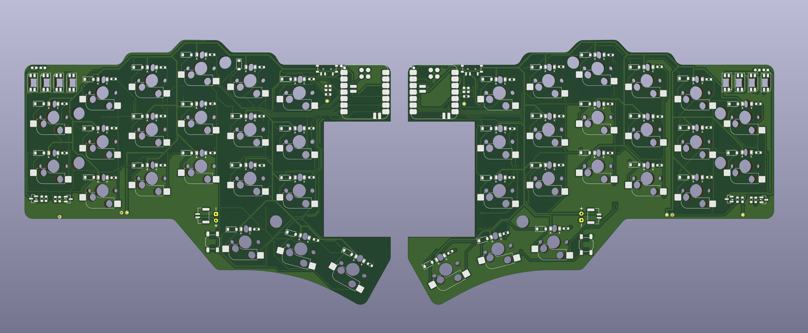

## The Wolf Split Keyboard

> [!WARNING]
> **Work In Progress (WIP)**: This project is currently under active development.

> 3×6 (+2 outer-pinky) Split Keyboard · 3 Thumb Keys · All 1U · MX Compatible

The **WᛝLF Keyboard** or just **wlfkbd** is a 40-key keyboard,
featuring 2 outer-pinky keys only to improve ergonomics. This keyboard takes inspiration from well-known open-source keyboards such as "Corne", "Klor", and "Delta/Omega".

### Specs

- Wireless BLE (XIAO nRF52840).
- Ultra low-profile build (<= 8mm).
- Low-profile switches and keycaps.
- Compatible with MX-Standard and Gateron KS33/3.0 Low-Profile switches.
- Good battery life (>=700mAh).
- Minimalist and industrial design.
- Aluminum case.
- MX-Spacing.
- Status LEDs.

> For details about the features, head to the [specs module](./docs/specs/)

## Layout Overview

| Zone | Columns | Rows | Keys/half | Notes |
|------|---------|------|-----------|-------|
| Matrix | 6 (outer → inner) | 3 (bottom, home, top) | 17 | Outer column skips bottom row (2 keys only) |
| Thumb | 3 (inner, home, outer) | 1 | 3 | Splayed arc, anchored below index |
| **Total** | | | **20** | **40 keys full board** |

### Column Stagger Profile

```
         outer  pinky  ring   middle  index  inner
stagger:   —    +u/2   +u/4   +u/4   −u/4   −u/4
mm:        0    +9.525 +4.763 +4.763 −4.763 −4.763
```



**Thumb Cluster Geometry**

| Key | Splay | Spread | Stagger | Effective rotation |
|-----|-------|--------|---------|--------------------|
| thumb_inner | 0° | u (19.05mm) | 0mm | 0° |
| thumb_home | −15° | u+2.5 (21.55mm) | −2.7mm | −15° |
| thumb_outer | −14° | u+2.5 (21.55mm) | −2.5mm | −29° |

The thumb cluster anchors at `matrix_index_bottom` with a `[-0.1u, -1.30u]` offset, placing it slightly left and well below the index column — a natural resting position for the thumb.

> See the Ergogen [config file here](./keyboard/ergogen/config.yml) (used only for the layout diagram)


## Motivations

After stepping into the rabbit hole of "Custom Split Keyboards", I found myself fascinated by this new world, different keyboard layouts, different techniques, and a lot of fun!

I used and own some beloved models that were created by incredible people, like:

- [Corne](https://github.com/foostan/crkbd)
- [Klor](https://github.com/GEIGEIGEIST/KLOR)
- [Delta/Omega](https://github.com/unspecworks/delta-omega)
- [Lily58](https://github.com/kata0510/Lily58)

And the Corne is my favorite keyboard out there (you may notice some similarities between the wlfkbd and crkbd).

Still, I was missing something—that little thing that would improve my experience with the keyboard. Then I started to test different layouts on paper, and came up with the layout that you saw earlier. I even used an "Ergo Pad" to understand the most comfortable way of typing for my long fingers.

### Features

I've taken inspiration from every piece of technology that I found aesthetically pleasing and useful, for example, Apple products. I really enjoy the white backlight of the built-in Mac keyboard.

So I wanted to implement this in the first revision. Even though I only use the backlight occasionally, it's a nice-to-have for me.

Then the major feature that I introduce here is the status LED on top of the outer-pinky column. It's something that I really wanted to have in previous keyboards, but didn't, so I've decided to implement it here.

Take a look at the current 3D render of the keyboard:



> For more pictures head to the [render gallery](./docs/renders/)

## Why "The Wᛝlf"?

I really enjoy the symbolism of "The Wolf", it reminds me of the raw aspect of being human and a strong connection with nature and solitude. Regarding the Norse rune, the "Inguz", it represents "transitions", "new beginnings", "a force of will", etc. I have it tattooed on my right arm, so it's also a personal reference.

## PCB Design

The PCB was built to be ordered already assembled. This means that all components are SMD, so while you may be able to solder them by hand, it requires solid soldering experience.


