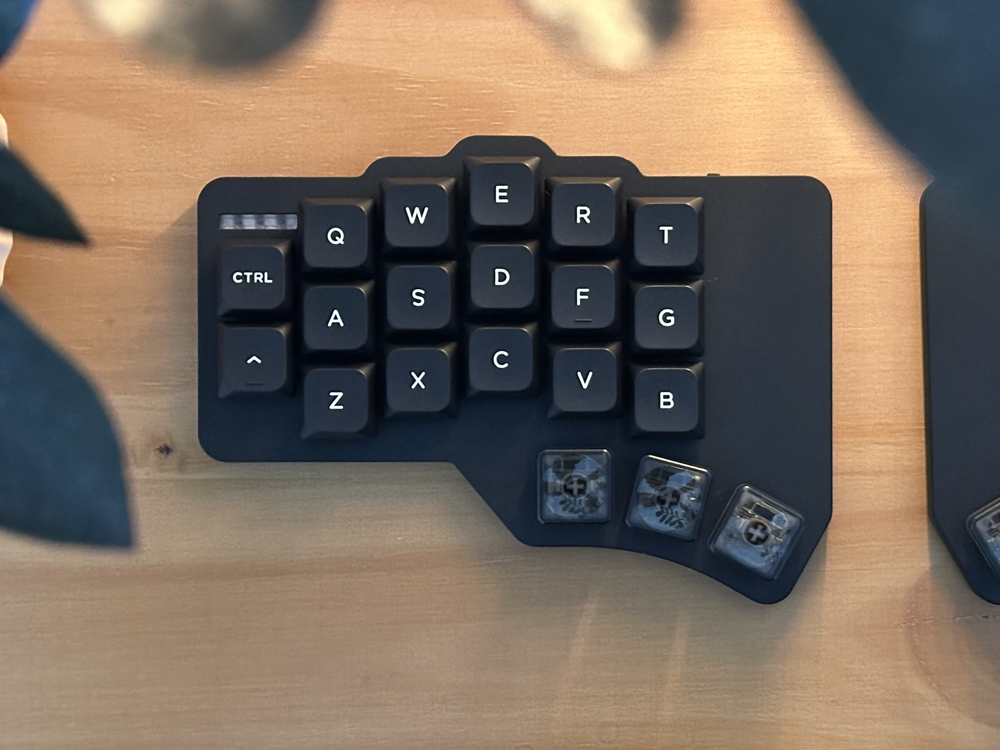
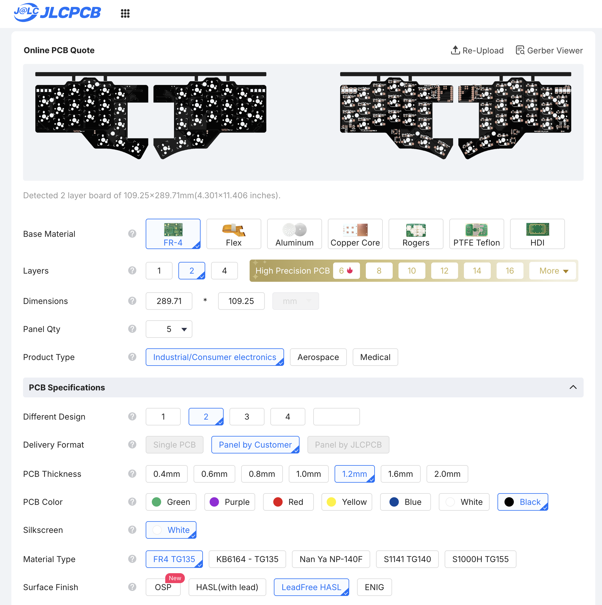
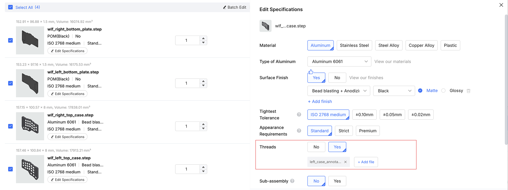
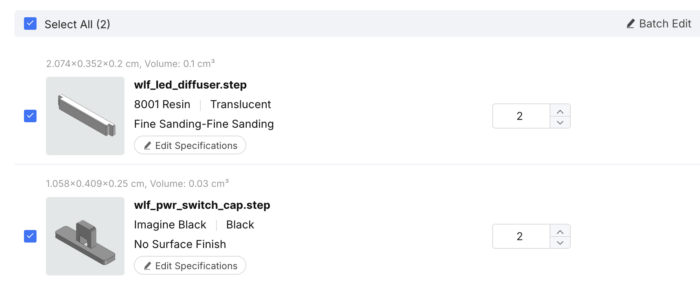
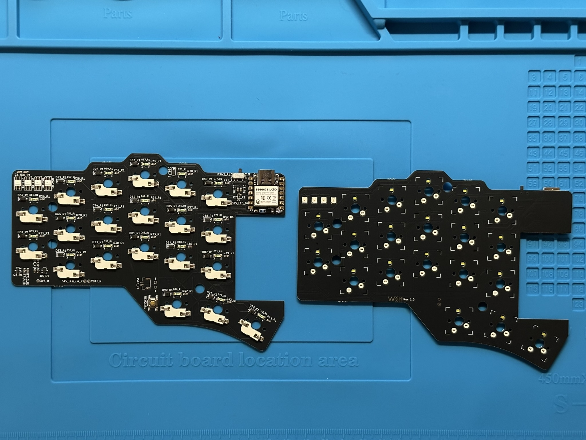
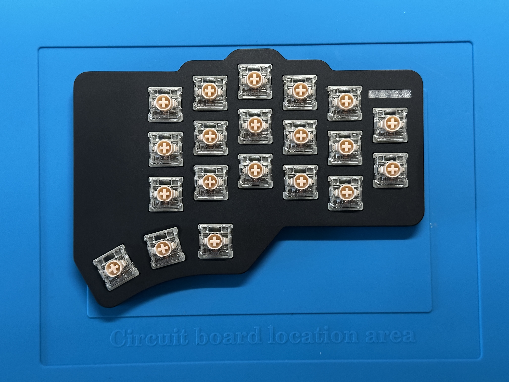
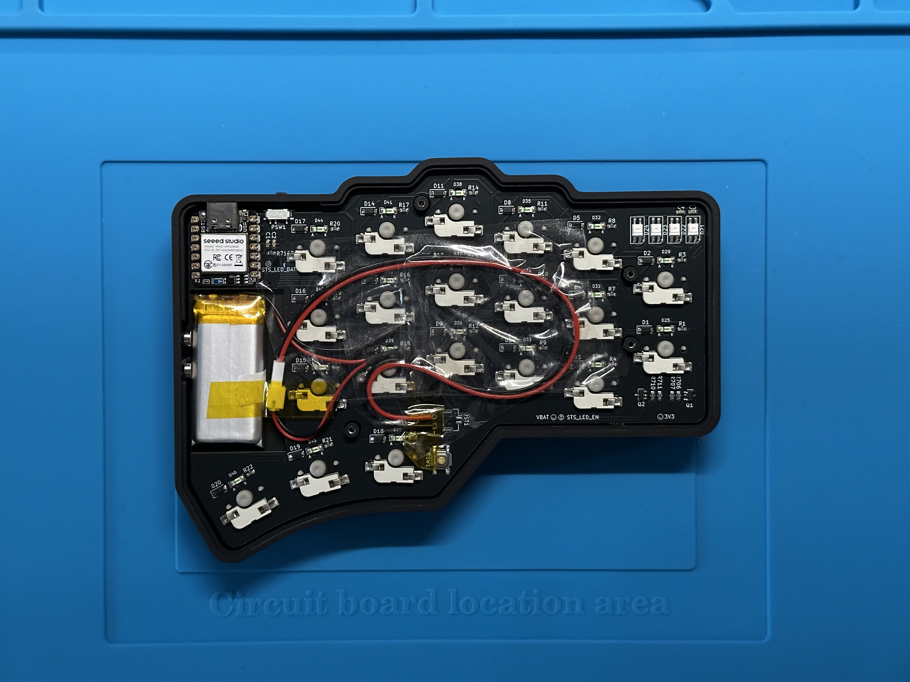
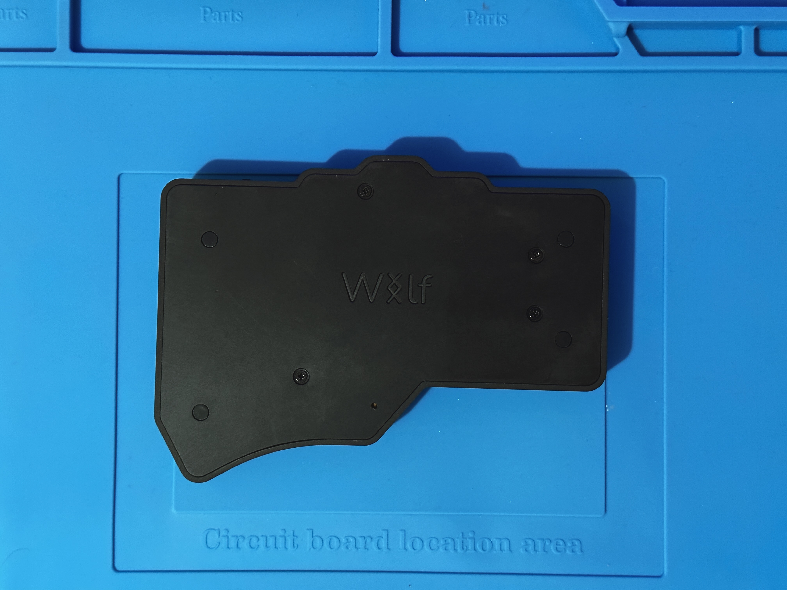
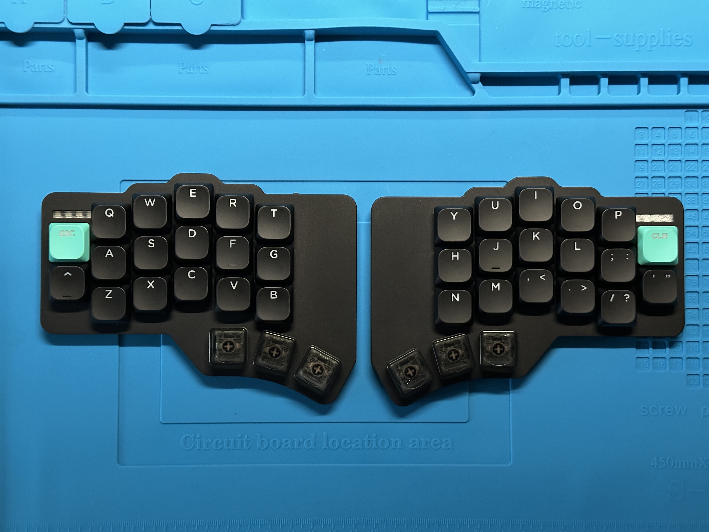

# Build Guide

This is the build guide for The Wolf Keyboard.

## Parts

The PCB is designed to be ordered with its SMD components pre-assembled, making the build easier but more expensive. You can solder the SMD components by hand if you prefer. You can also use a hot plate, though you may need a stencil for precise placement.

### Required

| Part Name                 | Part Number            | Count | Remarks                        |
| ------------------------- | ---------------------- | ----- | ------------------------------ |
| PCB                       | -                      | 2     | -                              |
| Seeed Studio XIAO nRF52840 | C37327670              | 2     | -                              |
| MX Switch Socket          | CPG151101S11-16        | 40    | -                              |
| Key switches              | Gateron LP KS33B - 3.0 | 40    | Or MX-style                    |
| Keycaps                   | -                      | 40    | Preferable low-profile, all 1U |
| Diodes 123-SOD            | 1N4148W                | 40    | -                              |
| Reset Button              | SKQGABE010             | 2     | -                              |
| Power Switch              | MK-12C02-G025          | 2     | -                              |
| LiPo Battery              | -                      | 2     | 602555 (Max)                   |

> [!INFO]
> Though the wlfkbd supports MX-standard switches, the case I designed supports Gateron LP KS33B switches only. You'll need to adapt the case to use standard MX switches.

### LED Backlight (Optional)

| Part Name        | Part Number     | Count | Remarks                                |
| ---------------- | --------------- | ----- | -------------------------------------- |
| White LED        | MHT151WDT       | 40    | White per-key backlight LED.           |
| LED Series R     | 0603WAF1001T5E  | 40    | 1 kΩ                                   |
| N-Channel MOSFET | AO3400A         | 2     | Low-side PWM switch for the backlight. |
| Gate Series R    | 0603WAF1000T5E  | 2     | 100 Ω                                  |
| Gate Pull-Down R | 0603WAF1002T5E  | 2     | 10 kΩ                                  |
| Bulk C           | CL10A106KP8NNNC | 2     | 10 µF                                  |
| Decoupling C     | CL10B104KB8NNNC | 2     | 100 nF                                 |

### Status LED (Optional)

| Part Name        | Part Number     | Count | Remarks                                   |
| ---------------- | --------------- | ----- | ----------------------------------------- |
| RGB LED          | SK68 MIN-E      | 8     |                                           |
| P-Channel MOSFET | AO3407A         | 2     | High-side load switch for the Status LEDs |
| Gate Series R    | 0603WAF1000T5E  | 2     | 100 Ω                                     |
| Gate Pull-Up R   | 0603WAF1003T5E  | 2     | 100 kΩ                                    |
| Data Series R    | 0603WAF3300T5E  | 2     | 330 Ω                                     |
| Decoupling C     | CL10B104KB8NNNC | 2     | 100 nF                                    |
| Bulk C           | CL10A106KP8NNNC | 2     | 10 µF                                     |

## Ordering Guides

> [!INFO]
> For more details about dimensions and surface finishes, see the [Measures & Materials tables](./tables.md).

### PCB

The production files are in [`wolf_keyboard/production/`](../../keyboard/kicad/revisions/wolf_keyboard/production/).

- `Wolf_Keyboard_1.0.0.zip`: Gerber files.
- `bom.csv`: bill of materials with JLCPCB part names.
- `positions.csv`: component placement file.

1. Open JLCPCB's [PCB quote page](https://jlcpcb.com/) and upload `Wolf_Keyboard_1.0.0.zip`.
2. Review the board preview and choose the required PCB options.
3. Add SMT assembly. Upload `bom.csv` as the BOM and `positions.csv` as the CPL / pick-and-place file.
4. Review the matched parts and placement preview. Confirm that both board sides and all listed components are included.

> [!INFO]
> You may need to reposition some components because the PCB component preview is not always accurate. In my case, I had to adjust the switch sockets and MCU placement before placing the order.

5. Choose the assembly quantity and finish the quote and order.

> Screenshot of the recommended PCB specifications

### Aluminum case

> The production files are in the [CNC folder](../../keyboard/case/CNC/).

1. Open JLCCNC's [machining quote page](https://jlccnc.com/cnc-machining-quote) and upload all `.STEP` files.
2. Review the files and choose the materials and finishes:

- Top case: Aluminum 6061 (Anodized + Bead Blasted)
- Bottom plate: POM Black (Anodized)

3. When editing the top case specifications, choose "Yes" for "Threads," then upload the corresponding case annotation files from the [annotations folder](../../keyboard/case/annotations/).

### 3D printed parts

> The production files are in the [3DP folder](../../keyboard/case/3DP/).

1. Open JLC3DP's [3D printing quote page](https://jlc3dp.com/3d-printing-quote) and upload all `.STEP` files.
2. Review the files and choose the materials and finishes:

- LED diffuser: SLA - 8001 (Translucent - Fine Sanding)
- Switch cap: SLA Imagine Black (3D Printing - No finish)

## Assembly

1. Let's take a look at the PCB.

2. Attach the switches to the case first, then insert the status LED cover into its slot.

> The switches may be difficult to insert, so you may need to push them firmly. Insert one side first, then the other, to help them fit into place.

3. Return to the PCB and solder the battery wires if you chose not to install the JST connector. Then insert the PCB into the case.

> [!INFO]
> The space between the PCB and case walls is tight, so install it carefully to avoid damaging anything. I'll add more clearance for the inner walls in a future revision. For now, take care during installation.

- Tilt the PCB slightly backward.
- Align it with the rear ports first, then lower the front into place.
- Attach the LiPo battery. You can use adhesive tape to organize the wires inside the case.

4. Insert the bottom plate, then fasten it to the top case with screws. Tighten them firmly, but do not overtighten.

<!--  -->

5. Insert the keycaps, and you're good to go!

