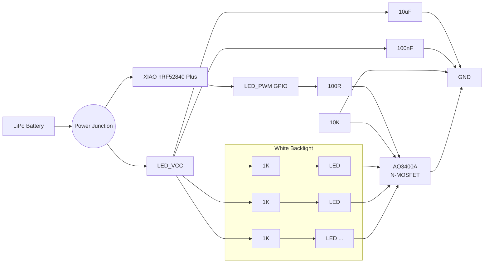

# Wlf Keyboard — White Backlight System

## Overview

Wlf uses a **single-zone white LED backlight** inspired by Apple's Magic Keyboard and MacBook keyboards. The objective is to provide a subtle, elegant, and battery-efficient backlight while keeping the hardware simple, inexpensive, and easy to manufacture using JLCPCB SMT Assembly.

Each keyboard half contains:

- One Seeed Studio XIAO nRF52840 Plus
- One AO3400A N-Channel MOSFET
- One warm white LED underneath each switch
- One current-limiting resistor per LED
- Dedicated LED power rail (`LED_VCC`)
- PWM brightness control

The entire backlight is controlled as a **single lighting zone**, allowing global brightness adjustment through PWM without requiring a dedicated LED driver.

### Why No LED Driver?

Wlf Rev. A intentionally avoids dedicated LED driver ICs (IS31FL37xx family).

Instead, all LEDs are switched simultaneously using a single PWM-controlled MOSFET.

#### Advantages

- Only one GPIO required
- Very small BOM
- Extremely simple schematic
- Easy PCB routing
- Excellent battery life
- Minimal firmware complexity
- Fully supported by ZMK PWM

#### Trade-offs

Supported:

- ✅ Backlight ON/OFF
- ✅ Global brightness control
- ✅ PWM dimming
- ✅ Fade in / Fade out
- ✅ Auto-off after inactivity

Not supported:

- ❌ Per-key brightness
- ❌ Reactive typing
- ❌ Ripple animations
- ❌ RGB effects
- ❌ Multiple lighting zones

# Power Architecture

Unlike the MCU and OLED, the backlight **does not use the XIAO's regulated 3.3 V output**.

Instead, the LEDs are powered directly from the battery.

Advantages:

- Lower regulator load
- Better battery efficiency
- Lower regulator temperature
- Higher available current
- Easier future expansion

The battery voltage is distributed into two independent branches:

- XIAO VBAT input
- LED_VCC (Backlight power rail)

---

# Electrical Architecture

---

# Bill of Materials (BOM)

| Component | Value / Part Number | KiCad Symbol | KiCad Footprint | JLCPCB Assembly | Remarks | PCB / Schematic Notes |
|-----------|---------------------|--------------|-----------------|-----------------|---------|-----------------------|
| MCU | Seeed Studio XIAO nRF52840 Plus | `Seeed Studio XIAO nRF52840 Plus` *(Seeed official library)* | `Module:Seeed_XIAO_nRF52840_Plus` | ❌ Module | Main controller | One module per keyboard half |
| White LED | 0603 Warm White LED (≈4000–4500K) | `Device:LED` | `LED_SMD:LED_0603_1608Metric` | ✅ Yes | White backlight | One LED per switch |
| LED Current Limiting Resistor | **1K ±1%** | `Device:R` | `Resistor_SMD:R_0603_1608Metric` | ✅ Yes | Current limiting | One resistor per LED (VBAT-powered design) |
| Gate Resistor | **100R ±1%** | `Device:R` | `Resistor_SMD:R_0603_1608Metric` | ✅ Yes | Limits MOSFET gate charging current | Place close to MOSFET gate |
| Gate Pull-down Resistor | **10K ±1%** | `Device:R` | `Resistor_SMD:R_0603_1608Metric` | ✅ Yes | Keeps MOSFET OFF during boot | Gate → GND |
| MOSFET | AO3400A | `Device:Q_NMOS_GSD` | `Package_TO_SOT_SMD:SOT-23` | ✅ Yes | Low-side PWM switch | One per keyboard half |
| Bulk Capacitor | **10uF X5R/X7R ≥6.3V** | `Device:C` | `Capacitor_SMD:C_0603_1608Metric` *(0805 also acceptable)* | ✅ Yes | Bulk decoupling | Between `LED_VCC` and GND |
| High-Frequency Capacitor | **100nF X7R** | `Device:C` | `Capacitor_SMD:C_0603_1608Metric` | ✅ Yes | PWM noise filtering | Place next to the 10uF capacitor |
| Test Point *(Optional)* | Test Pad | `Connector:TestPoint` | `TestPoint:TestPoint_Pad_D1.0mm` | Optional | Debugging | Recommended for `LED_VCC` (optionally `LED_PWM`) |

---

# PCB Design Guidelines

## LED Placement

- One LED centered underneath each switch.
- Keep the LED as close as possible to the switch opening.
- Maintain consistent orientation across the PCB.

## MOSFET Placement

Place the AO3400A:

- Close to the XIAO module
- Close to the `LED_PWM` GPIO
- Close to the main `LED_SWITCH` return path

This minimizes PWM trace length and switching noise.

## Capacitor Placement

Place the **10uF** and **100nF** capacitors:

- Immediately after the `LED_VCC` power entry
- Close together
- Before the LED power distribution begins

## Power Routing

Recommended trace widths:

| Signal | Recommended Width |
|----------|------------------:|
| BAT+ | 1.0 mm |
| LED_VCC | 0.5–1.0 mm |
| LED_SWITCH | 0.5–1.0 mm |
| LED_PWM | 0.20–0.25 mm |

---

# Firmware Features

Supported by the current hardware:

- Backlight ON/OFF
- Brightness adjustment
- PWM dimming
- Fade effects
- Auto-off after timeout
- Battery-saving modes

Future firmware may support:

- Ambient light sensor
- Automatic brightness
- Sleep fade animation

without requiring any hardware changes.

---

# Future Expansion

The current architecture intentionally leaves room for future revisions.

Possible upgrades include:

- Ferrite bead between `BAT+` and `LED_VCC`
- Current sensing
- Polyfuse protection
- Dedicated LED regulator
- I²C LED driver
- Multiple lighting zones

None of these upgrades require changing the LED placement or mechanical design.

---

# Final Design Summary

The Wlf backlight system prioritizes simplicity, efficiency, and longevity over visual effects.

The final architecture consists of:

- White-only backlight
- Single lighting zone
- PWM-controlled AO3400A MOSFET
- One resistor per LED
- LEDs powered directly from the battery (`VBAT`)
- Dedicated `LED_VCC` power rail
- 10uF + 100nF local decoupling
- No LED driver
- Fully compatible with ZMK
- Optimized for wireless battery-powered operation
- Easy to manufacture with JLCPCB SMT Assembly

This design closely follows the philosophy used in premium commercial keyboards: minimal hardware complexity, excellent battery life, and a clean, understated lighting experience.
