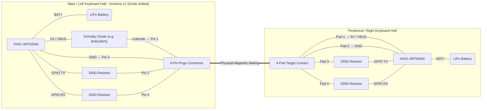
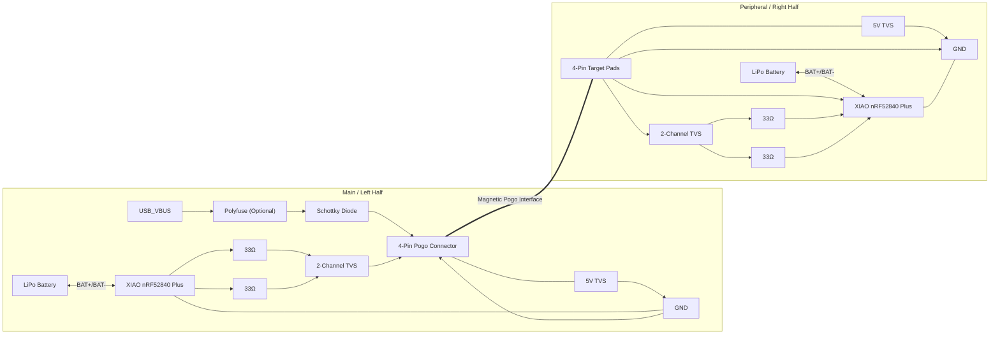

> This is currently a disabled feature, this document exists only for future reference.

## BOM

| Function                              | Recommended Part                                                       | Package                                       | KiCad Footprint                              | Placement Rule                                                      | Routing Rule                                                                                                                | Notes                                                                                           |
| ------------------------------------- | ---------------------------------------------------------------------- | --------------------------------------------- | -------------------------------------------- | ------------------------------------------------------------------- | --------------------------------------------------------------------------------------------------------------------------- | ----------------------------------------------------------------------------------------------- |
| **Magnetic Pogo Connector**           | Xinyangze **YZP0048-20048-04025-03** _(or equivalent 4-pin connector)_ | Vendor-specific                               | **Custom footprint**                         | **On the PCB edge**, aligned with the enclosure and magnets.        | Keep `POGO_VBUS`, `POGO_GND`, `POGO_LINK_IO1`, and `POGO_LINK_IO2` as short as practical leaving the connector.             | Verify mechanical clearance using the STEP model before manufacturing.                          |
| **Reverse Current Protection**        | **B5819WS**                                                            | SOD-323 / SOD-123W _(manufacturer dependent)_ | `Diode_SMD:D_SOD-323` or matching package    | **Near the USB/XIAO power input**, **not** near the pogo connector. | Route `USB_VBUS → Polyfuse → Schottky → POGO_VBUS`.                                                                         | Prevents power from the pogo connector or battery from backfeeding into the USB supply.         |
| **Overcurrent Protection (Optional)** | Polyfuse ~500 mA Hold _(e.g. 0ZCJ0050AF2E)_                            | 1206                                          | `Fuse:Fuse_1206_3216Metric`                  | Immediately after the USB power source.                             | Place before the Schottky diode.                                                                                            | Optional, but recommended for a premium design to protect against shorts on the pogo interface. |
| **VBUS ESD Protection**               | **SMF5.0A**                                                            | DO-219AB (SMF)                                | `Diode_SMD:D_SMF`                            | **As close as possible to the pogo connector.**                     | Connect **directly between `POGO_VBUS` and `GND`**. Use a **very short trace** and **dedicated GND via** beside the device. | First line of defense against ESD and transient surges on the charging pin.                     |
| **GPIO ESD Protection**               | **TPD2E2U06DCKR**                                                      | SC70-3 (DCK)                                  | `Package_TO_SOT_SMD:SOT-353_SC-70-3`         | **Immediately beside the pogo connector.**                          | Signal flow should be: **Pogo → TVS → 33 Ω → MCU**. Connect GND with a **dedicated via** next to the GND pin.               | Protects the exposed communication lines (`POGO_LINK_IO1`, `POGO_LINK_IO2`) from ESD.           |
| **Series Resistors**                  | **33 Ω ±1%**                                                           | 0402 or 0603                                  | `Resistor_SMD:R_0402_1005Metric` _(or 0603)_ | **Near the MCU**, not the connector.                                | One resistor per communication line, placed **after the TVS** and **before the MCU GPIO**.                                  | Improves signal integrity and limits transient current into the MCU.                            |

